# 📱 chatapp_light  
Application Flutter de messagerie instantanée moderne avec Firebase 🔥

---

## 🚀 Présentation

**chatapp_light** est une application Flutter complète de messagerie instantanée, intégrant des fonctionnalités avancées telles que l’envoi d’images, d’audios, les conversations de groupe, les statuts de messages, la gestion du statut en ligne/hors ligne, la modification et suppression des messages, une page de profil personnalisable, l’indicateur “en train d’écrire”, ainsi que l’indicateur “en train d’enregistrer un audio”.

Elle utilise **Firebase Authentication**, **Cloud Firestore**, **Firebase Storage**, **Firebase Messaging** et **Flutter Local Notifications** pour offrir une expérience fluide, moderne et performante.

---

## ✨ Fonctionnalités principales

### 🔐 Authentification
- Création de compte  
- Connexion / Déconnexion  
- Gestion de session  
- Thème d’authentification personnalisé  

---

## 💬 Messagerie instantanée

### 📩 Types de messages
- Texte  
- Images 🖼️  
- Audios 🎤  

### ⏱️ Informations des messages
- Heure exacte d’envoi  
- Date de dernière activité  
- Statuts :
  - **Envoyé**  
  - **Distribué**  
  - **Vu** 👁️  

### ✏️ Gestion des messages
- **Modifier un message** (texte)  
- **Supprimer un message pour moi**  
- **Supprimer un message pour tous** (comme WhatsApp)  

### 📝 Indicateurs en temps réel
- **En train d’écrire… ✍️**  
- **En train d’enregistrer un audio… 🎙️**  

---

## 👥 Conversations
- Conversations **1-to-1**  
- Conversations **de groupe**  
- Liste des utilisateurs connectés  
- Dernière activité visible (ex : *vu pour la dernière fois à 14:32*)  

---

## 🟢 Statut en ligne / hors ligne
- Mise à jour automatique du statut utilisateur  
- Affichage en temps réel dans les conversations  

---

## 🔔 Notifications
- Notifications push via **Firebase Messaging**  
- Notifications locales via **Flutter Local Notifications**  
- Gestion du handler en background  

---

## 👤 Profil utilisateur
- Page de profil complète  
- Modification du nom  
- **Photo de profil personnalisée** (upload Firebase Storage)  
- Dernière activité  
- Statut en ligne  

---

## 🎨 Interface moderne
- UI responsive  
- Thème clair/sombre  
- Architecture basée sur **Provider**  

---

## 🛠️ Technologies utilisées

| Technologie | Rôle |
|------------|------|
| Flutter | Framework UI multiplateforme |
| Firebase Auth | Authentification |
| Cloud Firestore | Base de données temps réel |
| Firebase Storage | Stockage des images & audios |
| Firebase Messaging | Notifications push |
| Flutter Local Notifications | Notifications locales |
| Provider | Gestion d’état |
| Dart | Langage principal |

---
## 📂 Structure du projet

lib/
├── providers/
│    ├── auth_provider.dart
│    ├── theme_provider.dart
├── services/
│    ├── chat_service.dart
│    ├── storage_service.dart
│    ├── notification_service.dart
├── views/
│    ├── login_page.dart
│    ├── register_page.dart
│    ├── chat_page.dart
│    ├── group_chat_page.dart
│    ├── users_page.dart
│    ├── profile_page.dart
├── firebase_options.dart
└── main.dart

---

## ⚙️ Installation & Exécution

### 1️⃣ Cloner le projet

git clone https://github.com/ELAMRANIAhlam/chatapp_light.git
cd chatapp_light

### 2️⃣ Installer les dépendances

flutter pub get

### 3️⃣ Configurer Firebase

Télécharger google-services.json (Android)

Télécharger firebase_options.dart via FlutterFire CLI

Configurer Firebase Storage (images & audios)

Activer Firestore et Authentication

### 4️⃣ Lancer l’application
▶️ Sur Chrome (Web) : 

flutter run -d chrome

▶️ Sur Android : 

flutter run -d android

---

## 📸 Screenshots

| 🔐 Login | 📝 Register | 🏠 Home |
|---------|-------------|---------|
| 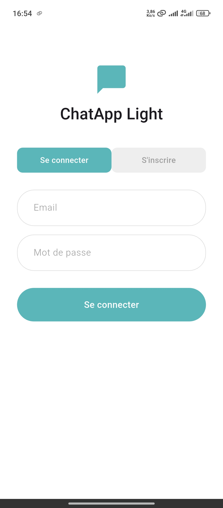 | 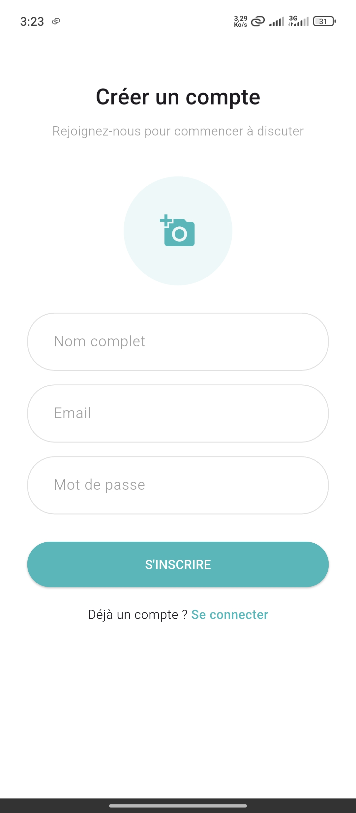 | 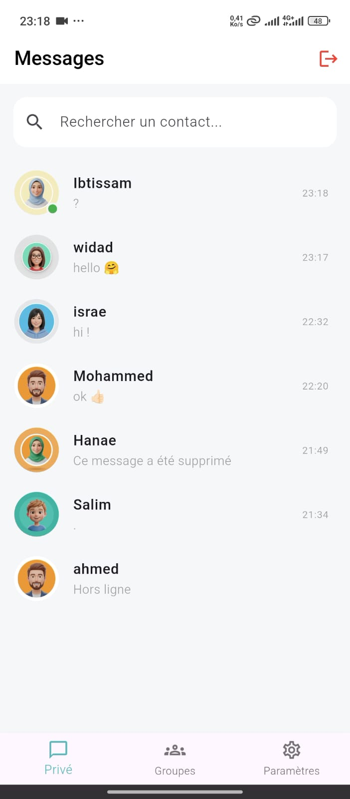 |

| 💬 Chat 1-to-1 | 👥 Group Chat | 👤 Profil utilisateur |
|----------------|----------------|------------------------|
| 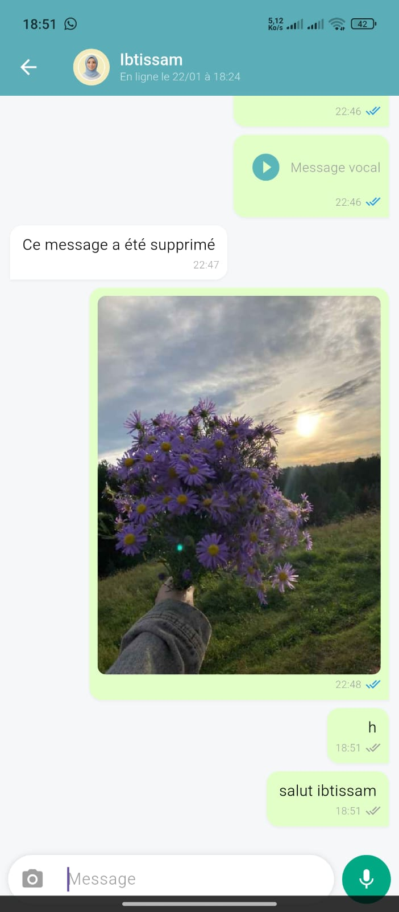 | 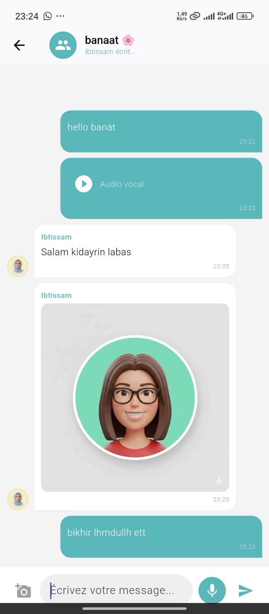 |  |

| ✏️ Modifier le profil | 🎙️ Indicateur "Enregistrement audio" | ✍️ Indicateur "En train d'écrire" |
|------------------------|--------------------------|-----------------------------------|
| 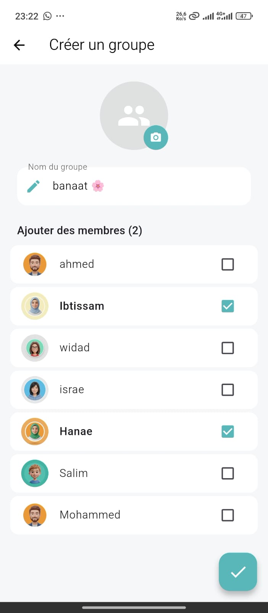 | 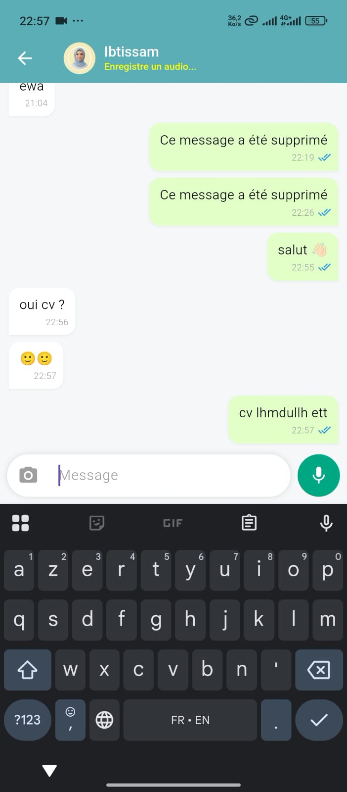 | 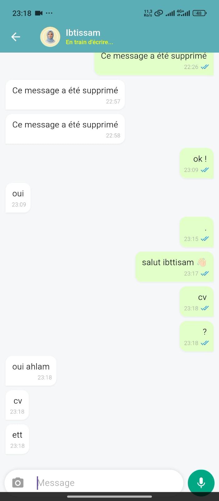 |

| 💬 Message supprimé | 🔍 Recherche | 📱 Notifications |
|--------------|-----------|----------------|
| 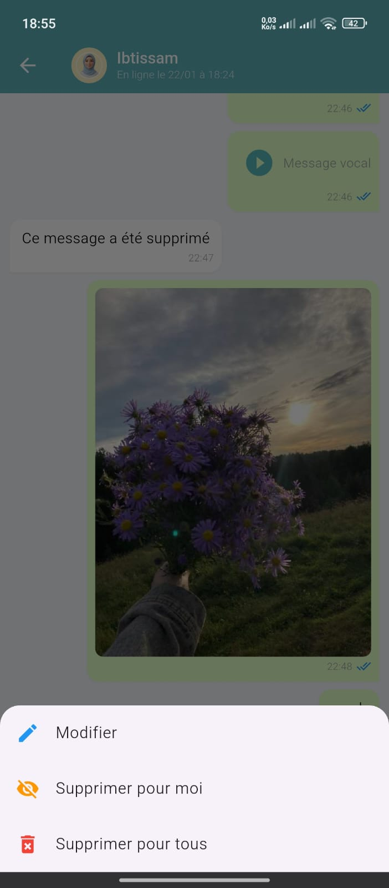 | 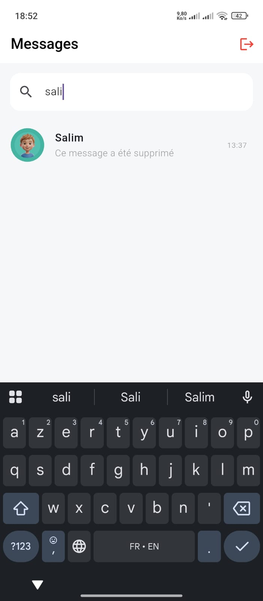 | 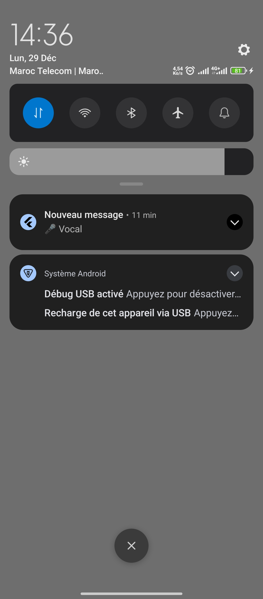 |

| ⚙️ Paramètres | 🌙 Mode sombre | 🚪 Logout |
|----------------|----|----|
| 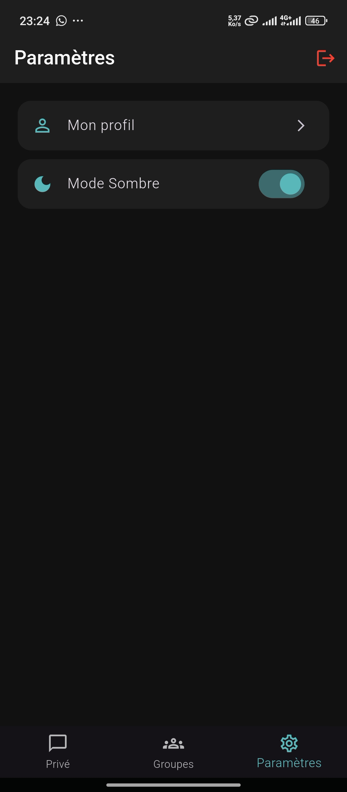 | 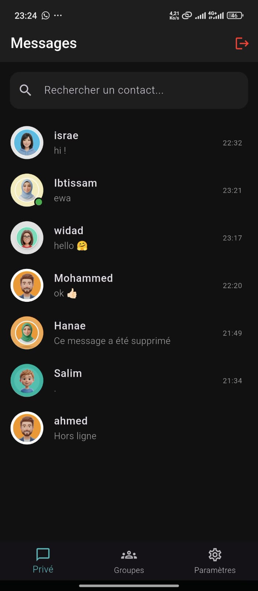 | 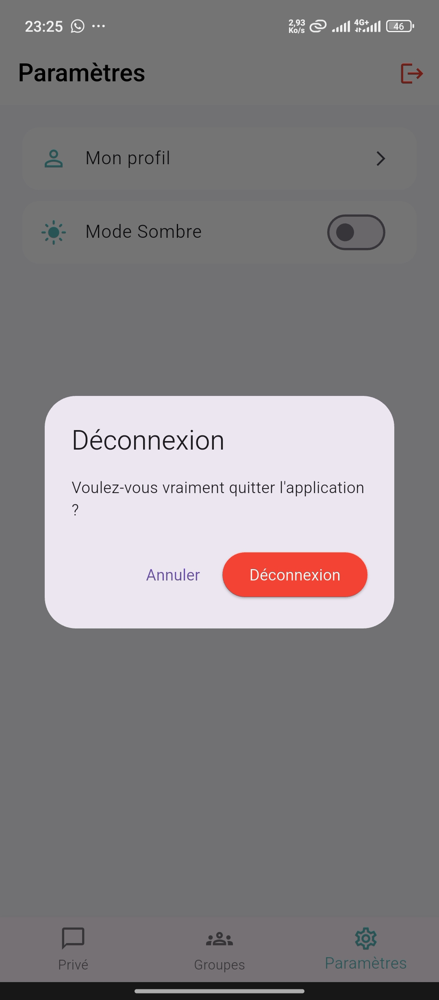 |

---

## 📌 Améliorations futures

- Appels audio/vidéo
- Stories (comme WhatsApp)
- Réactions aux messages
- Mode “disparition des messages”

---

## 👩‍💻 Auteur
Ahlam EL AMRANI  
Développeuse Mobile & Backend
📍 ENIAB
🔗 GitHub : https://github.com/ELAMRANIAhlam
